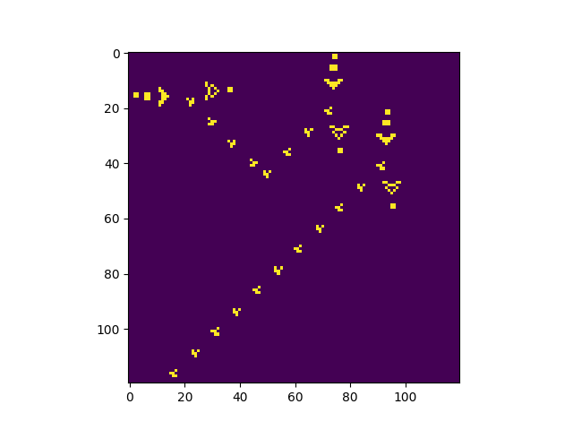
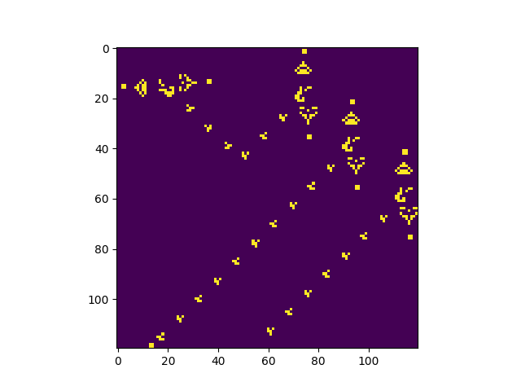

# Conway's Game of Life Logic Gates

This repository contains Python scripts that demonstrate the implementation and visualization of basic logic gates (AND, OR, NOT) using Conway's Game of Life. These scripts provide a unique way to explore the Theory of Computation through the lens of cellular automata.

| |  |
|:----------------------:|:----------------------:|
|    Logical AND Gate    |     Logical OR Gate    |

## Contents
- `AND.py`: Simulates an AND logic gate.
- `OR.py`: Simulates an OR logic gate.
- `NOT.py`: Simulates a NOT logic gate.

Each script configures a specific setup of glider guns and other patterns on a Game of Life grid to simulate the behavior of the respective logic gate. The simulation is visualized using Matplotlib, allowing you to see the evolution of these patterns over time.

You can install the required packages using pip:

```bash
pip install requirements.txt
```

## How It Works

### Conway's Game of Life

Conway's Game of Life is a cellular automaton where cells on a grid live, die, or multiply based on simple rules that you can read [here](https://en.wikipedia.org/wiki/Conway%27s_Game_of_Life). Despite its simplicity, the Game of Life can model complex systems, including digital logic gates.

### Logic Gates

Each logic gate (AND, OR, NOT) is simulated using a specific configuration of glider guns and other patterns within the Game of Life grid:

- **AND Gate**: Produces an output only when both inputs are active.
- **OR Gate**: Produces an output when at least one input is active.
- **NOT Gate**: Produces the inverse of the input.

The scripts place these configurations on the grid, where the interaction of the patterns simulates the gate's logic.

## License
This project is licensed under the MIT License. See the [LICENSE](LICENSE) file for more details.